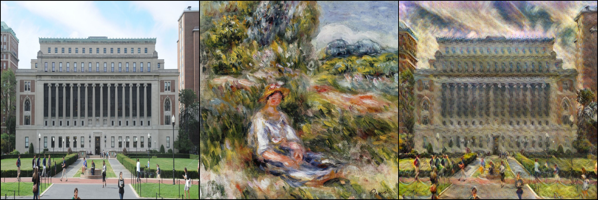
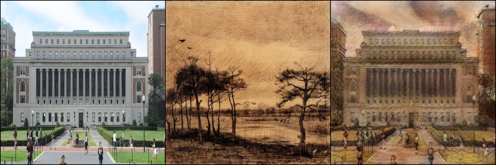
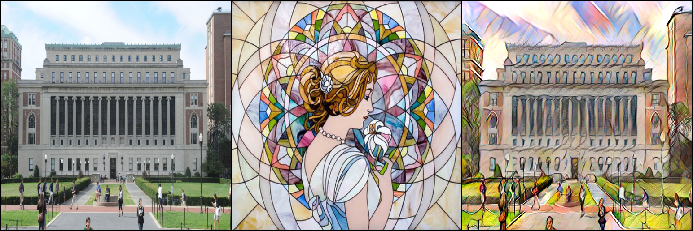
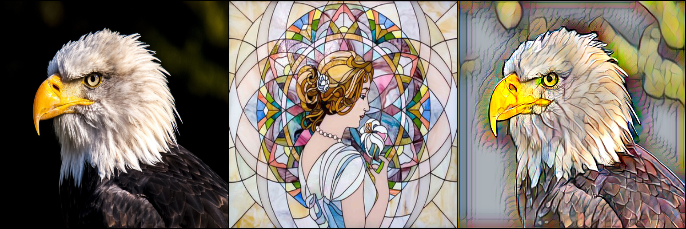
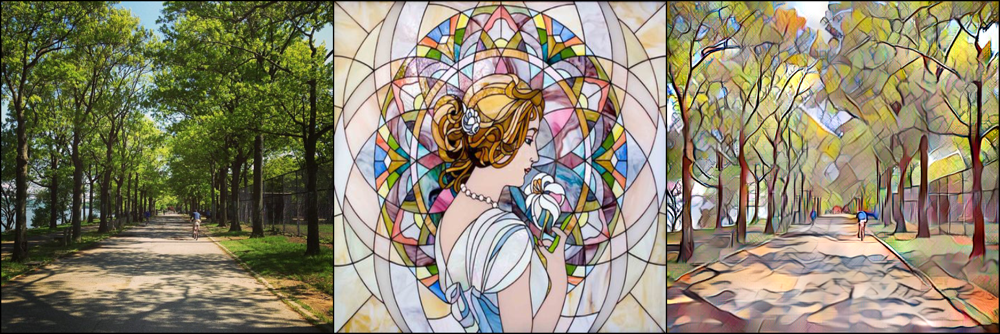
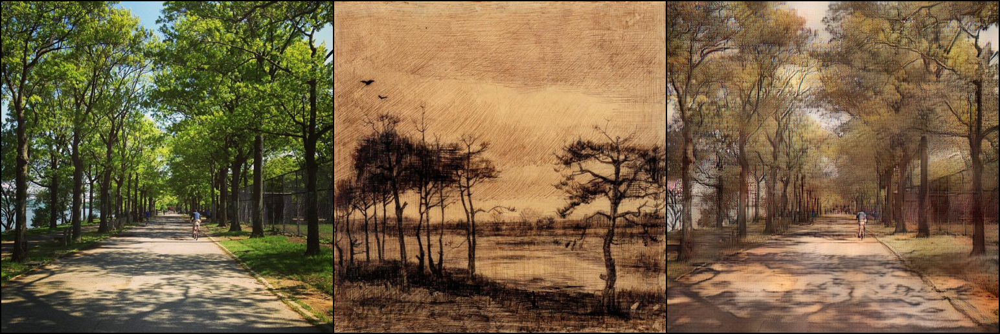

# AdaIN_NST
Arbitrary Style Transfer in Real-time with Adaptive Instance Normalization by Xun Huang, Serge Belongie

# Neural Style Transfer
Neural Style Transfer (NST) refers to the process of applying the style of one image (style image) to another image (content image) using neural network methods. The paper, 
"A Neural Algorithm of Artistic Style", by Gatys, et. al. (2015) introduced neural networks to image style transfer through an optimization approach that minimizes the 
perceptual feature loss which is calculated with a pretrained convolutional neural network. Feedforward approaches to this problem shortly followed, and allowed style transfer
in real time, yet restricted the set of styles to a finite set. In 2016, Ulyadov, et. al. found that Instance Normalization allowed the network to carry important style information and
 produce much better results in NST than batch normalization. In 2017, Huang, et. al. showed that a non-learnable Adaptive Instance Normalization layer can
 extend feedforward methods to arbitrary styles. 
 For an extended discussion, read the project report, project_report.pdf
 

# In this repository
* Implementation of the AdaIN paper as an iPython Notebook, including the training process and using the NST to make some cool results!
* Python implementation of the AdaIN paper with multi-gpu training support using DDP.
* Pretrained model

# Required packages
* torch, torchvision
* tqdm
* PIL
* matplotlib

# Datasets
You may use any image datasets with this model, I recommend WikiArt for style dataset if you want a wide range of artistic style transfers. MS COCO or similar image classification datasets may be used. For the pretrained model, I used WikiArt for the style images, and MSCOCO for my content image dataset, supplemented with a dataset of album covers (15% of the size of MSCOCO) from 512 album covers dataset.

# How to use:
1. clone this repository.
2. pip install -r requirement.txt
3. for training, consult python trainer.py -h. for testing, consult python eval.py -h

# Some results

# References and acknowledgements

